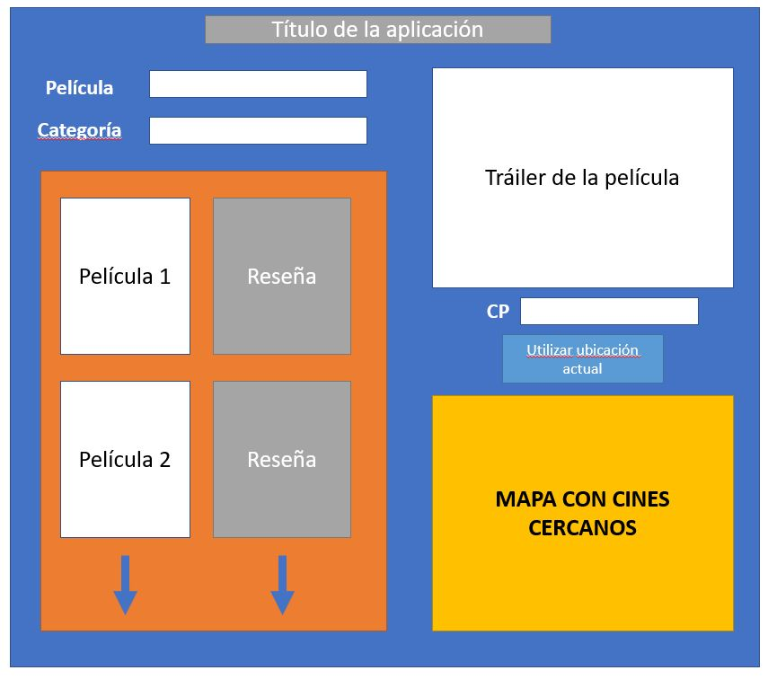

# Proyecto-1
Repositorio para Proyecto 1

## Buscador de estrenos para cinéfilos

## Descripción: 

Esta aplicación permite a los usuarios buscar estrenos de películas por nombre o categoría, desplegar el tráiler de dicha película y encontrar cines cercanos al usuario para que acuda a ver la película.

## Historia del usuario:

Como usuario cinéfilo  
Quiero encontrar las películas de estreno de mi categoría favorita  
Para que pueda enterarme de las novedades en dicha categoría  

Como usuario cinéfilo  
Quiero desplegar el tráiler de cierta película  
Para que pueda visualizar si me interesa verla  

Como usuario cinéfilo  
Quiero encontrar los cines cercanos a mi ubicación  
Para que pueda acudir a ver la película  

## Boceto del diseño

## APIs:

* API de Youtube
* API de Rotten Tomatoes
* API de Google Maps

## Desglose aproximado de tareas

* Crear diseño con elementos HTML
* Modificar propiedades de diseño con CSS para los elementos fijos de HTML
* Analizar API de Rotten Tomatoes para filtrar películas y traer datos de la película o películas (cuando se busca por categoría)
* Desplegar el póster de las películas y sus reseñas en la aplicación de forma dinámica
* Analizar API de Youtube, crear conexión y traer datos para poner el tráiler de la película
* Al dar clic sobre el póster de la película, desplegar el tráiler de la película en la aplicación
* Analizar API de Google Maps para buscar cines cercanos al código postal introducido por el usuario o utilizando la ubicación actual, crear conexión y obtener datos
* Investigar la manera de colocar el mapa de Google Maps con marcadores de los cines cercanos
* Colocar mapa en el espacio destinado en la aplicación con los cines cercanos marcados sobre el mapa
